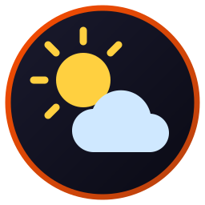

# outside

Three weather forecasts for one place, side by side: Yr, Storm and GFS.
Where they agree you can trust the day. Where they differ you see it at
once.

- Up to sixteen days ahead; tap a day for its hours.
- Each hour shows the rain with its chance, and the wind with its gusts.
- Official weather warnings for Norway on top, with a mark on each day
  they touch. Tap a warning for its full text.
- A dot per day: green when the forecasts agree, amber when they differ,
  red when they disagree. The open day says on what ("Rain: 0 to 14 mm").
- A score from 0 to 10 for being outside, the day's best stretch
  ("13 to 17"), and a star on the best of the next seven days.
- Sunrise and sunset for each day.
- Search for a place, follow the phone's position, save the places you
  come back to.
- The last forecast stays on the phone, so the app opens with numbers
  when there is no network.

## Widget

A clock for the home screen, one row tall and the full width.

- Left: the time, the date with the week number, and the next alarm.
- Middle: an analog clock. Its ring shows the weather of the next twelve
  hours, one stretch between two ticks for each hour: blue for rain, grey
  for cloud, yellow for sun. An hour is blue when one of the forecasts
  shows rain for it in the app. Small icons on the rim mark the next
  alarm, sunrise and sunset.
- Right: the ringer mode with the ring and alarm volume, the sign the sun
  is in, sunrise and sunset, moonrise and moonset, how much of the moon
  is lit, and its phase.
- A tap opens an app: the left part the clock app's alarms, the clock
  [rpnx](../rpnx/) when that is installed, and the right part outside.
- Choose another app for each of the three at the bottom of outside's
  screen, under "Widget: choose what a tap opens".
- A coral dot in the top right corner of the clock means a
  [fleet](https://github.com/isene/fleet) message waits for Claude on the
  phone. Switch it on at the bottom of outside's screen, under "Widget:
  show a dot when messages wait", by pasting the address of your fleet
  connector. Until then there is no dot, and the widget asks nobody. The
  dot follows the queue within about a minute.

The sun, the moon and the weather are for the place where outside last saw
the phone. The widget never asks for the position itself, so open outside
after a journey.

The weather is from the forecast outside last fetched, since the widget
fetches nothing. A forecast older than twelve hours colours nothing.

## Sources

| Column | From | Reach |
|---|---|---|
| Yr | MET Norway's `locationforecast` | about 10 days, hourly for the first two |
| Storm | TV 2's weather pages | 15 days, hourly for the first eleven |
| GFS | NOAA's model, through Open-Meteo | 16 days, hourly |

All three answer for any point on Earth, with no key and no account.
Place search uses Open-Meteo's geocoder (GeoNames data).

Warnings come from MET Norway's `metalerts`, which covers Norway, its
waters and Svalbard. Other countries get no warnings yet.

Storm has no public service for this. The app asks the same server
TV 2's own page asks, so that column can stop working the day TV 2
changes its page. The other two columns keep working when it does.

## Battery and privacy

- The app fetches when you open it, and only what is older than half an
  hour. Without the widget, nothing runs in the background.
- The home screen draws the widget's clocks by itself. The app is run on
  the full hour, and when the next alarm or the volume changes. It never
  wakes a sleeping phone. The widget uses no network, but for the dot
  when that is switched on.
- The phone's position is rounded to about a kilometre before it leaves
  the phone. The app asks for coarse location only.
- To let you choose what a tap on the widget opens, the app can see
  which apps have an icon on the phone. It reads that list only while
  you choose, and sends it nowhere.
- While the dot is switched on, a small watch stays up. It asks your
  fleet server how many messages wait: once a minute while the screen is
  on, and never while it is off. The address stays on the phone and is
  left out of backups.
- No account, no tracking, no ads.

## Code

- `core/src/outside.rs` builds the requests, reads the three answers and
  lays out the days and hours. It is pure Rust with tests.
- The Kotlin side fetches, keeps the answers in the cache folder and
  draws the screens.
- `Widget.kt` is the widget. Its sun and moon come from `outside_sky` in
  the core.
