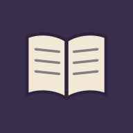

<div align="center">



# ref

    

An offline, searchable reference reader — glossaries, books, and personal writings in your pocket. Part of the [nomad](../../) mobile suite.

</div>

`com.isene.ref`

## What it does

Each **collection** is a searchable set of titled entries — a glossary
(term → definition), a book split into sections, or a set of writings.

- Pick a collection from the dropdown; search filters entries by title, then body
- Tap an entry to read it (text is selectable); back returns to the list
- Fully offline, no network, no permissions
- **Bundled** collections ship in the APK (public, mine)
- **Synced** collections load from a SAF folder of `.json` files you grant
  once — so copyrighted or personal corpora live only on your devices, never
  in this repo

Ships with a **Free Will & TEG** collection (my own writings). Add your own
collections as JSON in the synced folder.

## Collection format

```json
{
  "name": "My Glossary",
  "entries": [
    { "title": "Term", "body": "Definition text…" },
    { "title": "Another", "body": "…" }
  ]
}
```

Drop one or more such files in a Syncthing-shared folder, then point ref's
folder picker at it. They appear in the dropdown tagged "synced".

## Build

```bash
export JAVA_HOME=/usr/lib/jvm/java-17-openjdk-amd64
./gradlew :apps:ref:assembleRelease
```

APK → `apps/ref/build/outputs/apk/release/`. Sync and sideload.

## License

[Unlicense](https://unlicense.org/) — public domain (the app; bundled
writings remain their author's). Part of [nomad](../../) · [isene.org/nomad](https://isene.org/nomad/)
