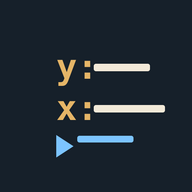

<div align="center">



# xrpn

     

A pocket HP-41 RPN scientific calculator — mobile companion to [XRPN](https://github.com/isene/xrpn). Part of the [nomad](../../) mobile suite.

</div>

`com.isene.xrpn` · pairs with [xrpn](https://github.com/isene/xrpn)

## What it does

The XRPN calculator, faithful to the desktop down to the number formatting.

- 4-level stack (X/Y/Z/T) + Last X + alpha + numbered registers + flags
- Open-ended **O6** entry, the full math / trig / log / stats / base-conversion
  command set, HMS and polar↔rect, FIX / SCI / ENG modes (comma decimal by default)
- **HP-41-style keypad** — wide ENTER top-left, and a **multi-shift** key that
  cycles coloured command pages (primary / f / g / modes) to reach the whole set
- HP-style pending prefix (STO then a digit), plus a command line for the long tail
- **State persists** across launches (stack, registers, flags, mode)
- **FOCAL program runner** — load `.xrpn` programs from a Syncthing-synced
  folder and RUN / single-step them: labels, GTO/XEQ/RTN/END, conditionals,
  ISG/DSE, PROMPT/VIEW

The stack engine, the XRPN-exact `to_num` formatter, and the FOCAL interpreter
live in the Rust core (`core/src/xrpn/`), so the phone computes — and displays —
identically to the desktop. (Along the way it fixed an ISG-decrement bug and a
float-fragile control-number decode, now upstreamed to desktop XRPN.)

## Build

```bash
export JAVA_HOME=/usr/lib/jvm/java-17-openjdk-amd64
export ANDROID_NDK_HOME="$HOME/.android-sdk/ndk/27.2.12479018"
./gradlew :apps:xrpn:assembleRelease
```

APK → `apps/xrpn/build/outputs/apk/release/`. Sync and sideload; point the
PRGM sheet at your synced `.xrpn` programs folder to run them.

## License

[Unlicense](https://unlicense.org/) — public domain. Part of [nomad](../../) · [isene.org/nomad](https://isene.org/nomad/)
